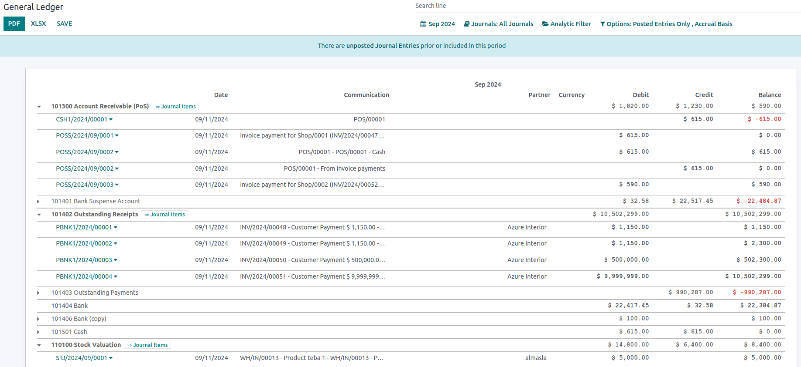

:show-content:

=========
Reporting
=========

Main reports available
======================

Odoo includes **generic** and **dynamic** reports available for all countries, regardless of the
:doc:`localization package <../../finance/fiscal_localizations>` installed:

-  :ref:`reporting/balance-sheet`
-  :ref:`reporting/profit-and-loss`
-  :ref:`reporting/executive-summary`
-  :ref:`reporting/general-ledger`
-  :ref:`reporting/aged-receivable`
-  :ref:`reporting/aged-payable`
-  :ref:`reporting/cash-flow-statement`
-  :ref:`reporting/tax-report`

Click the :icon:`fa-caret-down` (:guilabel:`down arrow`) to the right of the account, journal entry,
payment, invoice, etc. to :guilabel:`Annotate` and view details.

.. image:: reporting/reporting-annotate.png
   :alt: Annotate reports.

Export reports in PDF or XLSX format by clicking :guilabel:`PDF` or :guilabel:`XLSX` at the
top of the page.

Compare values across periods using the :guilabel:`Comparison` menu and select the periods you want
to compare.

.. image:: reporting/reporting-comparison.png
   :alt: Comparison menu to compare time periods.

.. _reporting/balance-sheet:

Balance Sheet
-------------

The :guilabel:`Balance Sheet` shows a snapshot of your organization's assets, liabilities, and
equity at a particular date.

.. image:: reporting/reporting-balance-sheet.png
   :alt: Balance sheet report of Odoo.

.. _reporting/profit-and-loss:

Profit and Loss
---------------

The :guilabel:`Profit and Loss` report (or **Income Statement**) shows your company's net income by
deducting expenses from revenue for the reporting period.

.. image:: reporting/reporting-profit-and-loss.png
   :alt: Profit and Loss report of Odoo

.. _reporting/executive-summary:

Executive Summary
-----------------

The :guilabel:`Executive Summary` allows a quick look at all the important figures for running your
company.

In basic terms, this is what each item in the following section reports:

- :guilabel:`Performance`:
    - :guilabel:`Gross profit margin`:
        The contribution of all sales your business makes **minus** any direct costs needed to
        make those sales (labor, materials, etc.).
    - :guilabel:`Net profit margin`:
        The contribution of all sales made by your business **minus** any direct costs needed to
        make those sales *and* fixed overheads your company has (electricity, rent, taxes
        to be paid as a result of those sales, etc.).
    - :guilabel:`Return on investment (per annum)`:
        The ratio of the net profit to the amount of assets the company used to make those profits.
- :guilabel:`Position`:
    - :guilabel:`Average debtors days`:
        The average number of days it takes your customers to (fully) pay you across all your
        customer invoices.
    - :guilabel:`Average creditors days`:
        The average number of days it takes you to (fully) pay your suppliers across all your bills.
    - :guilabel:`Short-term cash forecast`:
        How much cash is expected in or out of your business in the next month, i.e., the balance of
        your **Sales account** for the month **minus** the balance of your **Purchases account** for
        the month.
    - :guilabel:`Current assets to liabilities`:
        Also referred to as the **current ratio**, this is the ratio of current assets (:dfn:`assets
        that could be turned into cash within a year`) to the current liabilities (:dfn:`liabilities
        that will be due in the next year`). It is typically used to measure a company's ability to
        service its debt.

.. image:: reporting/reporting-executive-summary.png
   :alt: Executive summary report in Odoo.

.. _reporting/general-ledger:

General Ledger
--------------

The :guilabel:`General Ledger` report shows all transactions from all accounts for a selected date
range. The initial summary report shows the totals for each account. Click the :icon:`fa-caret-down`
(:guilabel:`down arrow`) on the left to expand the accounts and view a detailed report.
This report is useful for reviewing each transaction that occurred during a specific period.

.. _reporting/aged-receivable:

Aged Receivable
---------------

The :guilabel:`Aged Receivable` report shows the sales invoices awaiting payment during a selected
month and several months prior.

.. image:: reporting/reporting-aged-receivable.png
   :alt: Aged Receivable report in Odoo.

.. _reporting/aged-payable:

Aged Payable
------------

Run the :guilabel:`Aged Payable` report to display information on individual bills, credit notes,
and overpayments you owe and how long these have gone unpaid.

.. image:: reporting/reporting-aged-payable.png
   :alt: Aged Payable report in Odoo.

.. _reporting/cash-flow-statement:

Cash Flow Statement
-------------------

The :guilabel:`Cash Flow Statement` shows how changes in balance sheet accounts and income affect
cash and cash equivalents and breaks the analysis down to operating, investing, and financing
activities.

.. image:: reporting/reporting-cash-flow-statement.png
   :alt: Cash Flow Statement report in Odoo.

.. _reporting/tax-report:

Tax Report
----------

This report shows the :guilabel:`NET` and :guilabel:`TAX` amounts for all the taxes
grouped by type (:guilabel:`Sales`/:guilabel:`Purchases`).

.. image:: reporting/reporting-tax-report.png
   :alt: Tax report in Odoo.

.. toctree::
   :titlesonly:

   reporting/tax_returns
   reporting/tax_carryover
   reporting/analytic_accounting
   reporting/budget
   reporting/intrastat
   reporting/data_inalterability
   reporting/silverfin
   reporting/customize
   reporting/year_end
